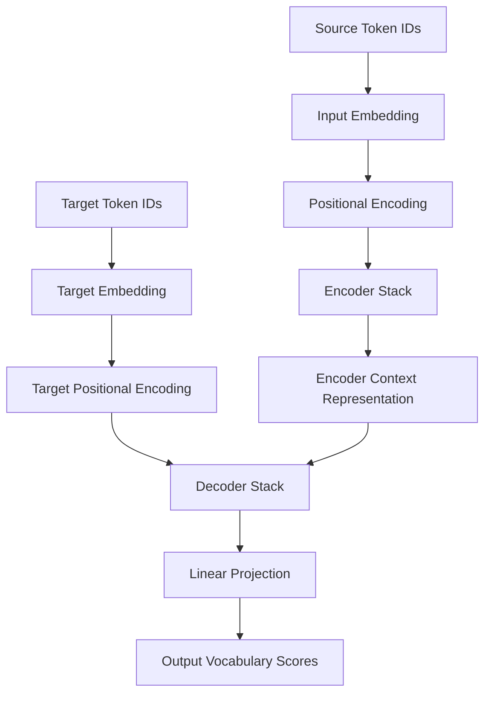

# TransForge: Building Transformers from the Ground Up

> **A from-scratch PyTorch exploration of Transformer architecture, attention mechanisms, and encoder–decoder computation.**

[](https://www.python.org/)
[](https://pytorch.org/)
[](https://jupyter.org/)
[](#license)

## Overview

**TransForge** is an educational deep learning project that explores the internal architecture of Transformer models using PyTorch.

The project breaks down the Transformer into its fundamental components, including input embeddings, sinusoidal positional encoding, scaled dot-product attention, multi-head attention, feed-forward networks, layer normalization, residual connections, encoder blocks, decoder blocks, and output projection.

It is designed to help learners and researchers understand how Transformer architectures process sequential data, how attention mechanisms model relationships between tokens, and how encoder–decoder systems transform input representations into output vocabulary predictions.

The repository contains component-level notebooks and a broader Transformer implementation for experimenting with the architecture and inspecting tensor transformations.

> **Project status:** Educational implementation and architecture exploration. The supplied notebooks do not establish a fully trained or benchmarked Transformer model.

---

## Key Features

- **Input Embeddings**
  - Converts token IDs into dense vector representations.
  - Scales embeddings using the square root of the model dimension.

- **Sinusoidal Positional Encoding**
  - Adds positional information to token embeddings.
  - Uses sine and cosine functions across embedding dimensions.
  - Stores positional encodings as a non-trainable buffer.

- **Scaled Dot-Product Attention**
  - Computes query–key compatibility scores.
  - Scales scores using the square root of the key dimension.
  - Supports optional attention masks.
  - Applies softmax to obtain attention weights.

- **Multi-Head Attention**
  - Projects queries, keys, and values.
  - Splits representations into multiple attention heads.
  - Combines head outputs using an output projection.

- **Feed-Forward Network**
  - Uses two linear layers with ReLU activation.
  - Includes dropout for regularization.

- **Layer Normalization**
  - Normalizes hidden representations along the feature dimension.
  - Uses learnable scale and bias parameters in the modular implementation.

- **Residual Connections**
  - Supports residual connections around attention and feed-forward sublayers.
  - Combines residual learning with normalization and dropout.

- **Encoder–Decoder Architecture**
  - Modular encoder and decoder blocks.
  - Decoder self-attention and encoder–decoder cross-attention.
  - Output projection to a target vocabulary.

- **Architecture Construction**
  - Configurable model dimensions, number of heads, encoder layers, decoder layers, and feed-forward dimensions.
  - Xavier initialization in the Transformer builder.

- **Notebook-Based Learning**
  - Separate notebooks for attention, positional encoding, and Transformer components.
  - Tensor-shape demonstrations using dummy input data.

---

## Architecture

The project follows the standard encoder–decoder Transformer design introduced in:

> Vaswani et al., *Attention Is All You Need* (2017).

The original architecture is based on attention mechanisms rather than recurrence or convolution in its sequence-transduction core.

### High-Level Workflow



### Encoder

The encoder processes the input sequence and produces contextual representations.

Each encoder block contains:

1. Multi-head self-attention.
2. Residual connection and normalization.
3. Position-wise feed-forward network.
4. Residual connection and normalization.

Conceptually:

```text
Input Embeddings
       |
       v
Multi-Head Self-Attention
       |
       v
Residual Connection + Normalization
       |
       v
Feed-Forward Network
       |
       v
Residual Connection + Normalization
       |
       v
Encoder Output
```

### Decoder

The decoder generates representations for the target sequence while attending to the encoder output.

Each decoder block is intended to contain:

1. Masked multi-head self-attention.
2. Encoder–decoder cross-attention.
3. Feed-forward network.
4. Residual connections and normalization around sublayers.

Cross-attention uses:

- **Query:** Decoder representation.
- **Key:** Encoder output.
- **Value:** Encoder output.

The target mask is intended to prevent the decoder from accessing future target tokens during autoregressive generation.

### Output Projection

The decoder hidden representation is mapped to the target vocabulary dimension.

```text
Decoder Output
      |
      v
Linear Projection
      |
      v
Target Vocabulary Scores
      |
      v
Log-Softmax / Token Prediction
```

The supplied projection implementation uses a linear layer followed by log-softmax.

---

## Mathematical Foundations

This section explains the mathematical operations behind the Transformer architecture implemented in TransForge.

### 1. Input Embeddings

Input tokens are converted into dense vector representations using an embedding layer.

Given a sequence of token IDs:

\[
X = [x_1, x_2, \ldots, x_n]
\]

The embedding layer maps each token to a vector of dimension \(d_{\text{model}}\):

\[
E = \operatorname{Embedding}(X)
\]

The resulting embedding matrix has the shape:

\[
E \in \mathbb{R}^{n \times d_{\text{model}}}
\]

To maintain an appropriate scale, the embeddings are multiplied by the square root of the model dimension:

\[
E_{\text{scaled}} = E \cdot \sqrt{d_{\text{model}}}
\]

**Purpose:** Converts discrete token IDs into continuous vector representations that can be processed by the Transformer.

---

### 2. Positional Encoding

Unlike recurrent networks, the self-attention mechanism does not inherently encode the order of tokens. Positional encoding adds information about the position of each token in the sequence.

The sinusoidal positional encoding is defined as follows.

#### Even Dimensions

For even embedding dimensions:

\[
PE_{(pos,\,2i)}
=
\sin\left(
\frac{pos}{10000^{\frac{2i}{d_{\text{model}}}}}
\right)
\]

#### Odd Dimensions

For odd embedding dimensions:

\[
PE_{(pos,\,2i+1)}
=
\cos\left(
\frac{pos}{10000^{\frac{2i}{d_{\text{model}}}}}
\right)
\]

Where:

- \(pos\): Position of the token in the sequence.
- \(i\): Dimension index.
- \(d_{\text{model}}\): Embedding dimension.

The positional encoding is added to the token embeddings:

\[
Z = E_{\text{scaled}} + PE
\]

**Purpose:** Provides positional information so that the model can distinguish between tokens at different positions.

---

### 3. Scaled Dot-Product Attention

Scaled dot-product attention is the fundamental operation used by the Transformer to model relationships between tokens.

The attention mechanism takes three inputs:

- **Query (Q):** Represents the information being searched for.
- **Key (K):** Represents the information used for matching.
- **Value (V):** Represents the information that is aggregated.

The attention operation is defined as:

\[
\operatorname{Attention}(Q,K,V)
=
\operatorname{softmax}
\left(
\frac{QK^\top}{\sqrt{d_k}}
\right)V
\]

#### Step-by-Step Computation

**Step 1: Calculate the attention scores**

\[
S = QK^\top
\]

**Step 2: Scale the scores**

\[
S_{\text{scaled}}
=
\frac{QK^\top}{\sqrt{d_k}}
\]

**Step 3: Apply softmax**

\[
A =
\operatorname{softmax}
\left(
\frac{QK^\top}{\sqrt{d_k}}
\right)
\]

**Step 4: Compute the weighted values**

\[
O = AV
\]

Where:

- \(Q\): Query matrix.
- \(K\): Key matrix.
- \(V\): Value matrix.
- \(d_k\): Key dimension.
- \(A\): Attention weight matrix.
- \(O\): Attention output.

**Purpose:** Allows each token to incorporate information from other relevant tokens in the sequence.

---

### 4. Attention Masking

Attention masks control which tokens are accessible during attention computation.

Before applying softmax, masked positions are assigned a large negative value (conceptually \(-\infty\)):

\[
S_{ij}^{\text{masked}}
=
\begin{cases}
S_{ij}, & \text{if position } j \text{ is allowed} \\
-\infty, & \text{if position } j \text{ is masked}
\end{cases}
\]

The resulting attention probabilities are:

\[
A =
\operatorname{softmax}
\left(
S^{\text{masked}}
\right)
\]

**Purpose:**

- Padding masks prevent attention to padding tokens.
- Causal masks prevent a decoder from attending to future target tokens.

---

### 5. Multi-Head Attention

Multi-head attention allows the Transformer to learn different relationships between tokens through multiple attention heads.

Given the model dimension \(d_{\text{model}}\) and the number of attention heads \(h\), the dimension of each head is:

\[
d_k = \frac{d_{\text{model}}}{h}
\]

The queries, keys, and values are projected separately for each head:

\[
Q_i = XW_i^Q
\]

\[
K_i = XW_i^K
\]

\[
V_i = XW_i^V
\]

The attention output for each head is:

\[
\operatorname{head}_i
=
\operatorname{Attention}(Q_i,K_i,V_i)
\]

The outputs of all heads are concatenated:

\[
H =
\operatorname{Concat}
\left(
\operatorname{head}_1,
\operatorname{head}_2,
\ldots,
\operatorname{head}_h
\right)
\]

Finally, the concatenated output is projected:

\[
\operatorname{MultiHead}(Q,K,V)
=
HW^O
\]

Where:

- \(h\): Number of attention heads.
- \(W_i^Q, W_i^K, W_i^V\): Projection matrices for head \(i\).
- \(W^O\): Output projection matrix.

**Purpose:** Enables the model to attend to different representation subspaces and relationships simultaneously.

---

### 6. Feed-Forward Network

Each Transformer encoder and decoder block contains a position-wise feed-forward network.

The network consists of two linear transformations with a ReLU activation:

\[
FFN(x)
=
W_2\operatorname{ReLU}(W_1x+b_1)+b_2
\]

The implementation applies dropout between the two linear layers.

**Purpose:** Applies a nonlinear transformation to each token representation independently.

---

### 7. Residual Connections and Layer Normalization

Residual connections help preserve information from earlier layers and support the training of deep neural networks.

A residual connection can be represented as:

\[
y = x + \operatorname{Sublayer}(x)
\]

With dropout and normalization, the exact computation depends on the architecture's normalization arrangement.

For a post-normalization arrangement:

\[
y =
\operatorname{LayerNorm}
\left(
x + \operatorname{Dropout}(\operatorname{Sublayer}(x))
\right)
\]

Layer normalization is applied over the feature dimension.

**Purpose:**

- Residual connections facilitate information flow.
- Layer normalization stabilizes hidden representations.
- Dropout helps reduce overfitting during training.

---

### 8. Encoder–Decoder Cross-Attention

In the decoder, cross-attention connects the decoder representation to the encoder output.

The decoder generates queries, while the encoder output supplies keys and values:

\[
Q = X_{\text{decoder}}W^Q
\]

\[
K = X_{\text{encoder}}W^K
\]

\[
V = X_{\text{encoder}}W^V
\]

The cross-attention operation is:

\[
\operatorname{CrossAttention}
=
\operatorname{Attention}
\left(
Q_{\text{decoder}},
K_{\text{encoder}},
V_{\text{encoder}}
\right)
\]

**Purpose:** Allows the decoder to use information from the encoded source sequence while processing target tokens.

---

### 9. Output Projection

The final decoder representation is mapped to the target vocabulary dimension using a linear projection.

Given a decoder output \(H\):

\[
Z = HW_{\text{proj}} + b_{\text{proj}}
\]

Where:

- \(H\): Decoder hidden representation.
- \(W_{\text{proj}}\): Output projection matrix.
- \(b_{\text{proj}}\): Projection bias.

For a vocabulary of size \(V\):

\[
Z \in \mathbb{R}^{n \times V}
\]

When log-softmax is applied:

\[
\log P(y_t \mid y_{<t},x)
=
\operatorname{LogSoftmax}(Z_t)
\]

**Purpose:** Produces vocabulary-level scores for predicting target tokens.

---

### Summary

The Transformer architecture combines:

1. Input embeddings.
2. Positional encoding.
3. Scaled dot-product attention.
4. Multi-head attention.
5. Feed-forward networks.
6. Residual connections and layer normalization.
7. Encoder–decoder cross-attention.
8. Output projection.

Together, these components form the mathematical foundation of the encoder–decoder Transformer architecture explored in TransForge.


## Technologies & Libraries

| Technology | Purpose |
|---|---|
| Python | Programming language |
| PyTorch | Neural network implementation and tensor computation |
| NumPy | Numerical experimentation and softmax demonstrations |
| Pandas | Data manipulation imports in attention-related notebooks |
| Jupyter Notebook | Interactive experimentation and learning |
| Hugging Face Datasets | Dataset loading utilities imported in the evaluation notebook |
| Hugging Face Tokenizers | Tokenizer construction utilities imported in the evaluation notebook |
| TensorBoard | Logging utility imported in the evaluation notebook |
| tqdm | Progress bar utility |

### Core PyTorch Components

- `torch.nn.Module`
- `torch.nn.Embedding`
- `torch.nn.Linear`
- `torch.nn.Dropout`
- `torch.nn.Parameter`
- `torch.nn.ModuleList`
- PyTorch tensor operations and softmax

---

## Installation & Setup

### Prerequisites

- Python 3.9 or later
- Jupyter Notebook or JupyterLab
- PyTorch
- pip
- Optional: NVIDIA GPU with a compatible PyTorch installation

The notebooks should be run in an environment where the required dependencies are installed.

### 1. Clone the Repository

```bash
git clone https://github.com/<your-username>/TransForge.git
cd TransForge
```

Replace `<your-username>` with your GitHub username.

### 2. Create a Virtual Environment

#### Windows

```bash
python -m venv .venv
.venv\Scripts\activate
```

#### Linux / macOS

```bash
python3 -m venv .venv
source .venv/bin/activate
```

### 3. Install Dependencies

Install PyTorch according to the official instructions:

https://pytorch.org/get-started/locally/

Install the supporting packages:

```bash
pip install numpy pandas jupyter notebook tqdm tensorboard
pip install datasets tokenizers
```

> The supplied notebooks do not include a `requirements.txt` file. Verify the dependencies and versions in your environment before executing every notebook.

### 4. Launch Jupyter Notebook

```bash
jupyter notebook
```

Open the notebook you want to explore.

---

## Usage

### Recommended Learning Order

#### Step 1: Explore Positional Encoding

Open:

```text
PositionalEncoding.ipynb
```

Study:

- Token sequences.
- Positional information.
- Sine and cosine functions.
- Positional encoding dimensions.

#### Step 2: Explore Self-Attention

Open:

```text
SelfAttention.ipynb
```

Study:

- Query, key, and value concepts.
- Self-attention.
- Masked and unmasked attention.
- Attention weight computation.

#### Step 3: Explore Multi-Head Attention

Open:

```text
MultiHead_Attention.ipynb
```

Study:

- Multiple attention heads.
- Projection matrices.
- Attention score computation.
- Concatenation of head outputs.

#### Step 4: Study the Transformer Components

Open:

```text
Transformer.ipynb
```

Explore:

- Input embeddings.
- Positional encoding.
- Multi-head attention.
- Layer normalization.
- Feed-forward networks.
- Residual connections.
- Encoder and decoder blocks.
- Projection layer.

#### Step 5: Run the Construction Demonstration

Open:

```text
transformer_evaluationipynb.ipynb
```

The notebook creates a configurable Transformer instance and uses dummy token IDs to inspect the intended data flow.

Example configuration:

```python
input_vocab_size = 100
output_vocab_size = 120

input_seq_len = 10
decoder_seq_len = 12

d_model = 64
nhead = 4

num_encoder_layers = 2
num_decoder_layers = 2

dim_feedforward = 128
dropout = 0.1
```

The model builder is called with these configuration values:

```python
transformer = build_transformer(
    input_vocab_size,
    output_vocab_size,
    input_seq_len,
    decoder_seq_len,
    d_model,
    nhead,
    num_encoder_layers,
    num_decoder_layers,
    dim_feedforward,
    dropout
)
```

### Important Execution Note

The current evaluation notebook contains placeholder attention behavior and should not be interpreted as a fully functional training or inference implementation.

Before using the project for translation or other real NLP tasks, the attention and encoder–decoder components must be validated and corrected.

---

## Model Configuration

The Transformer builder accepts the following parameters:

| Parameter | Description |
|---|---|
| `input_vocab_size` | Source vocabulary size |
| `output_vocab_size` | Target vocabulary size |
| `input_seq_len` | Maximum source sequence length |
| `decoder_seq_len` | Maximum target sequence length |
| `d_model` | Embedding and hidden representation dimension |
| `nhead` | Number of attention heads |
| `num_encoder_layers` | Number of encoder blocks |
| `num_decoder_layers` | Number of decoder blocks |
| `dim_feedforward` | Hidden dimension of the feed-forward network |
| `dropout` | Dropout probability |

### Example Model

```text
Input vocabulary size: 100
Output vocabulary size: 120

d_model: 64
Attention heads: 4

Encoder layers: 2
Decoder layers: 2

Feed-forward dimension: 128
Dropout: 0.1
```

The example configuration is intended for architecture exploration and dummy-input testing.

---

## Implementation Status

| Feature | Status |
|---|---|
| Input embeddings | Implemented |
| Sinusoidal positional encoding | Implemented in notebook components |
| Scaled dot-product attention | Present in the core implementation |
| Multi-head attention | Core implementation and evaluation placeholder |
| Feed-forward network | Implemented |
| Layer normalization | Implemented |
| Residual connections | Implemented in the core architecture |
| Encoder blocks | Present, requires validation |
| Decoder blocks | Present, requires validation |
| Output projection | Implemented |
| Model construction | Implemented as a builder |
| Dummy forward-pass demonstration | Included |
| End-to-end training | Not established by supplied notebooks |
| Dataset-based evaluation | Not established by supplied notebooks |
| Autoregressive generation | Not established by supplied notebooks |
| Automated unit tests | Not included in supplied files |

---

## Known Limitations

The following limitations should be addressed before describing the project as a complete Transformer training framework.

### 1. Attention Placeholder in Evaluation Notebook

The evaluation notebook's attention class generates random output tensors rather than computing the attention operation.

**Planned improvement:**

- Implement scaled dot-product attention.
- Apply attention masks correctly.
- Return the concatenated multi-head output.
- Validate attention shapes and numerical behavior.

### 2. Encoder–Decoder Validation

Some implementations across the notebooks contain inconsistencies in method signatures, tensor flow, or component wiring.

**Planned improvement:**

- Standardize the interfaces for all components.
- Validate the encoder and decoder stacks.
- Add shape and integration tests.

### 3. No Training Pipeline

The supplied notebooks do not establish a complete training workflow with:

- Dataset preprocessing.
- Loss calculation.
- Optimizer setup.
- Backpropagation.
- Checkpoint saving.
- Validation metrics.

### 4. No Benchmark Results

No validated benchmark results are included in the supplied notebooks.

Any future performance claims should be based on reproducible experiments and clearly documented datasets, hyperparameters, and evaluation metrics.

---

## References / Papers

The following references provide the theoretical foundation for the architecture explored in this project.

### 1. Attention Is All You Need

**Authors:** Ashish Vaswani, Noam Shazeer, Niki Parmar, Jakob Uszkoreit, Llion Jones, Aidan N. Gomez, Łukasz Kaiser, Illia Polosukhin

**Year:** 2017

**Venue:** Advances in Neural Information Processing Systems (NeurIPS)

**Links:**

- [arXiv:1706.03762](https://arxiv.org/abs/1706.03762)
- [DOI: 10.48550/arXiv.1706.03762](https://doi.org/10.48550/arXiv.1706.03762)
- [NeurIPS Paper](https://papers.nips.cc/paper/2017/hash/3f5ee243547dee91fbd053c1c4a845aa-Abstract.html)

**Relevance:**

The foundational paper introducing the Transformer architecture based on attention mechanisms. It provides the basis for the encoder–decoder design, scaled dot-product attention, multi-head attention, and positional encoding explored in this project.

### 2. Layer Normalization

**Title:** Layer Normalization

**Authors:** Jimmy Lei Ba, Jamie Ryan Kiros, Geoffrey E. Hinton

**Year:** 2016

**Link:**

- [arXiv:1607.06450](https://arxiv.org/abs/1607.06450)

**Relevance:**

Provides the theoretical foundation for layer normalization, which is used in the Transformer components.

> **Reference note:** This paper is relevant to the implementation, but the supplied notebooks do not explicitly document it as a cited source.

### 3. Word2Vec

**Title:** Distributed Representations of Words and Phrases and their Compositionality

**Authors:** Tomas Mikolov, Ilya Sutskever, Kai Chen, Greg Corrado, Jeffrey Dean

**Year:** 2013

**Link:**

- [arXiv:1310.4546](https://arxiv.org/abs/1310.4546)

**Relevance:**

The core Transformer notebooks contain a Word2Vec-related learning section. This paper is included as contextual reading for distributed word representations.

> **Reference note:** The supplied notebooks do not establish a Word2Vec training pipeline or demonstrate that Word2Vec embeddings are used in the Transformer implementation.

### Additional Technical Documentation

- [PyTorch Documentation](https://pytorch.org/docs/stable/index.html)
- [PyTorch `nn.Embedding`](https://pytorch.org/docs/stable/generated/torch.nn.Embedding.html)
- [PyTorch `nn.MultiheadAttention`](https://pytorch.org/docs/stable/generated/torch.nn.MultiheadAttention.html)
- [Jupyter Documentation](https://docs.jupyter.org/en/latest/)

---

## Future Work / Roadmap

The following roadmap focuses on transforming the educational implementation into a validated, reusable Transformer project.

### Phase 1 — Code Quality & Correctness

- [ ] Refactor notebook implementations into Python modules.
- [ ] Correct method signatures and tensor-flow issues.
- [ ] Implement fully functional scaled dot-product attention.
- [ ] Implement correct masked self-attention.
- [ ] Validate encoder and decoder block operations.
- [ ] Add unit tests for tensor shapes and attention outputs.

### Phase 2 — Training Pipeline

- [ ] Add dataset preprocessing.
- [ ] Implement source and target tokenization.
- [ ] Add padding and causal masks.
- [ ] Implement training and validation loops.
- [ ] Add cross-entropy loss.
- [ ] Add optimizer and learning-rate scheduling.
- [ ] Add checkpoint saving and loading.

### Phase 3 — Inference & Evaluation

- [ ] Implement autoregressive decoding.
- [ ] Add greedy decoding.
- [ ] Add beam search.
- [ ] Evaluate on a suitable sequence-to-sequence dataset.
- [ ] Report reproducible evaluation metrics.
- [ ] Add inference examples.

### Phase 4 — Research & Visualization

- [ ] Visualize attention matrices.
- [ ] Compare different positional encoding strategies.
- [ ] Study pre-normalization and post-normalization architectures.
- [ ] Analyze the effect of attention heads.
- [ ] Compare model configurations.
- [ ] Explore computational efficiency and memory usage.

---

## Contributing

Contributions are welcome.

If you would like to improve the project:

1. Fork the repository.
2. Create a feature branch.
3. Implement and test your changes.
4. Submit a pull request.

Example:

```bash
git checkout -b feature/improve-attention
```

Please include clear explanations of changes and any relevant experimental results.

---

## License

**License: To be specified.**

The supplied notebooks do not establish an existing repository license.

If you intend to distribute the project as an open-source educational implementation, consider adding an [MIT License](https://choosealicense.com/licenses/mit/) after deciding on the appropriate licensing terms.

---

## Acknowledgments

- The authors of *Attention Is All You Need* for introducing the Transformer architecture.
- The PyTorch community for deep learning tools and documentation.
- The open-source machine learning community for educational resources and implementation guidance.

---

## Author

**Rishikesh Raj**

B.S. Computer Science & Data Analytics  
Indian Institute of Technology Patna

GitHub: [Rishikesh1411](https://github.com/Rishikesh1411)

---

## Disclaimer

This project is intended for educational purposes and architectural experimentation.

The current implementation should not be considered a production-ready Transformer training framework. Verify all components and experimental results before using the project for research claims or real-world applications.
